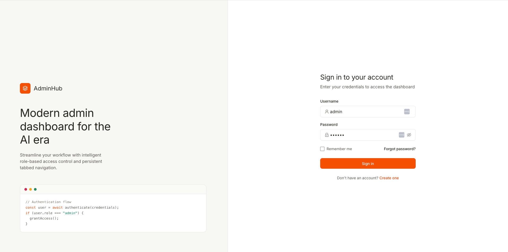
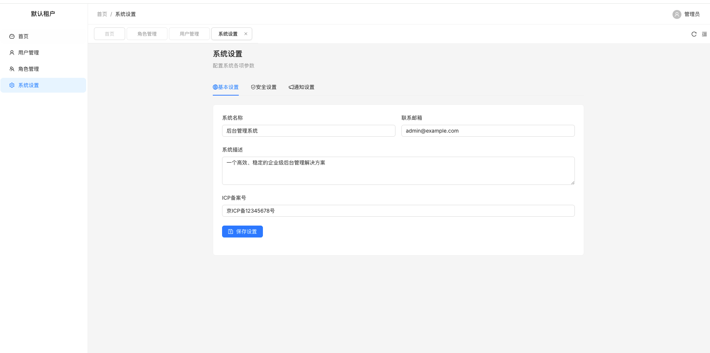

# React Admin

基于 React 19 + Vite + TypeScript 的后台管理系统，包含基于角色的路由、持久化标签页导航和中文本地化。





## 技术栈

| 类别 | 技术 |
|------|------|
| 框架 | React 19 + React Router 7 |
| 构建 | Vite |
| UI 库 | Ant Design 6 |
| 状态管理 | Zustand |
| 数据请求 | Axios + SWR |
| 标签页缓存 | keepalive-for-react |
| 路由进度 | NProgress |

## 快速开始

```bash
pnpm install
pnpm dev
```

## 功能特性

- **基于角色的路由**：动态过滤路由，根据用户角色控制权限
- **持久化标签页**：支持标签页缓存，刷新不丢失状态
- **中文本地化**：开箱即用的中文界面
- **路由进度条**：顶部 NProgress 加载进度指示

## 项目结构

```
src/
├── components/
│   └── Layout/         # 主布局组件
├── hooks/             # 自定义 Hooks
├── routes/             # 路由配置与权限过滤
├── stores/             # Zustand 状态管理
├── App.tsx             # 根组件
└── main.tsx           # 入口文件
```

## 常用命令

| 命令 | 说明 |
|------|------|
| `pnpm dev` | 启动开发服务器 |
| `pnpm build` | 生产构建（类型检查 + Vite 构建）|
| `pnpm lint` | 运行 ESLint |
| `pnpm preview` | 预览生产构建 |

## 路由架构

系统路由分为两组：

- **静态路由** (`constantRoutes`)：登录页、AppLayout 外壳、403、NotFound
- **动态路由** (`asyncRoutes`)：仪表盘、用户管理、角色管理、系统设置，根据用户角色动态加载

## 认证流程

1. 初始化时从 `localStorage` 恢复认证信息
2. 登录成功后存储 `token` 和用户信息
3. `authStore` 根据用户角色过滤可访问路由
4. 登出时清除存储并重置标签页状态